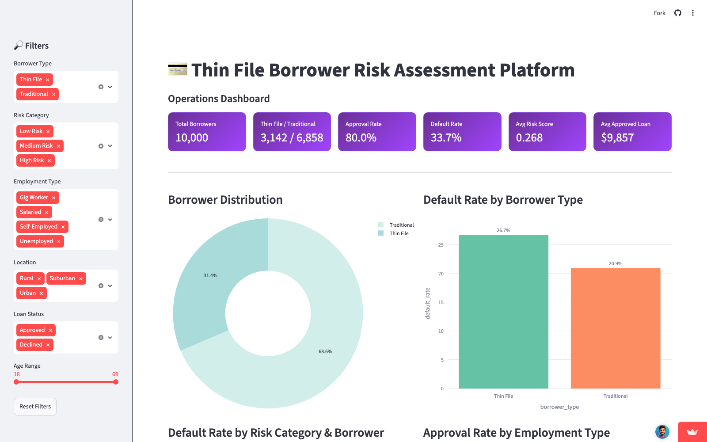

# Thin File Borrower Risk Assessment Platform

An end-to-end credit risk pipeline that scores "thin file" borrowers — people with little or no traditional credit history — using alternative data signals (utility payments, rent history, banking behavior, employment) instead of relying solely on a FICO-style credit score.

**🔗 Live Dashboard:** [thin-file-borrower-risk-assessment-platform-qdyebxmfrumof2irqo.streamlit.app](https://thin-file-borrower-risk-assessment-platform-qdyebxmfrumof2irqo.streamlit.app/)

## Business Problem

Lenders routinely reject or under-approve applicants who lack a conventional credit file, even when those applicants are creditworthy. This locks out a large segment of the market (gig workers, young borrowers, recent movers) not because they're inherently riskier, but because the data used to assess them is incomplete. This project demonstrates how alternative data can be used to extend credit decisions to that population without abandoning risk discipline.

## Approach

1. **Data generation** — synthesizes a 10,000-borrower dataset with realistic alternative-data signals (utility/rent/mobile payment behavior, banking activity, employment) and traditional credit fields, where traditional fields are deliberately missing for thin-file borrowers (`1_data_exploration/`).
2. **Feature engineering** — derives savings ratio, debt-to-income ratio, income stability, and a composite payment-reliability score; normalizes alternative signals (`2_feature_engineering/`).
3. **Segmentation** — splits the population into Thin File vs. Traditional and compares default rates and feature profiles, with inline visualizations (`3_borrower_segmentation/segmentation_analysis.ipynb`).
4. **Modelling** — trains two separate XGBoost classifiers (one per segment) so the traditional-credit model doesn't penalize thin-file borrowers for missing fields, and the thin-file model isn't diluted by traditional-only features. Includes ROC curves, confusion matrices, and a SHAP-based explainability layer that turns model output into per-borrower, plain-English risk explanations (`4_predictive_modelling/train_xgboost_models.ipynb`).
5. **Data warehouse** — loads scored borrowers into a SQLite star schema (borrower profile, alternative data, traditional data, risk assessment, loan performance, loan applications) for analytical querying (`5_sql_database/`).
6. **Analytical queries** — business-facing SQL answering approval-rate, default-rate, and portfolio-expansion questions (`6_analytical_queries/`).
7. **Dashboard** — interactive Streamlit/Plotly app exposing portfolio KPIs, default-rate breakdowns, and risk-tier drill-downs, with sidebar filters for borrower type, risk category, employment type, location, loan status, and age (`7_streamlit_dashboard/`).
8. **Business insights** — executive summary translating model output into a lending-policy recommendation (`8_business_insights/`).

## Tech Stack

Python (pandas, NumPy, scikit-learn, XGBoost, SHAP) · SQLite/SQL · Streamlit · Plotly · Jupyter

## Key Results

On the synthetic 10,000-borrower dataset:

- **31.4%** of borrowers are thin-file (3,142 of 10,000); the remaining 68.6% have traditional credit history.
- **Default rate:** 32.4% for thin-file borrowers vs. 24.5% for traditional borrowers — higher, but predictable using alternative signals rather than unknowable.
- **Top thin-file default drivers (XGBoost feature importance):** overdraft frequency (12.4%), payment reliability score (11.5%), mobile disconnects (9.5%), gig-worker status (8.4%).
- **Top traditional-borrower drivers:** credit score (13.3%), overdraft frequency (10.3%), payment reliability score (7.7%) — notably, behavioral signals matter even when a credit score is available.
- **Portfolio recommendation:** expanding approvals to "Medium Risk" thin-file borrowers (currently declined) is projected to grow loan origination volume by 12–15% while raising the blended portfolio default rate by only ~1.5 points — a favorable risk/volume trade-off if medium-risk loans are priced accordingly.

See `8_business_insights/Executive_Summary.md` for the full write-up and `3_borrower_segmentation/segmentation_report.md` for the underlying segment comparison.

## Dashboard Preview



## How to Run

```bash
pip install -r requirements.txt

# 1. Generate synthetic borrower data
python 1_data_exploration/generate_synthetic_data.py

# 2. Engineer features
python 2_feature_engineering/feature_engineering.py

# 3. Segment thin-file vs. traditional borrowers (Jupyter notebook)
jupyter notebook 3_borrower_segmentation/segmentation_analysis.ipynb

# 4. Train risk models, score borrowers, and generate SHAP explanations (Jupyter notebook)
jupyter notebook 4_predictive_modelling/train_xgboost_models.ipynb

# 5. Load scored data into the SQLite star schema
python 5_sql_database/load_data_to_sqlite.py

# 6. (Optional) Explore 6_analytical_queries/lending_decision_queries.sql
#    against 5_sql_database/lending_operations.db

# 7. Launch the dashboard
streamlit run 7_streamlit_dashboard/app.py
```

The repo already includes generated CSVs in `data/`, so you can skip straight to a later stage (e.g. just run step 5 and 7) without re-running the full pipeline.

## Notes

All data is synthetically generated (`numpy` with a fixed seed) for demonstration purposes — there is no real borrower or loan data in this repository.
